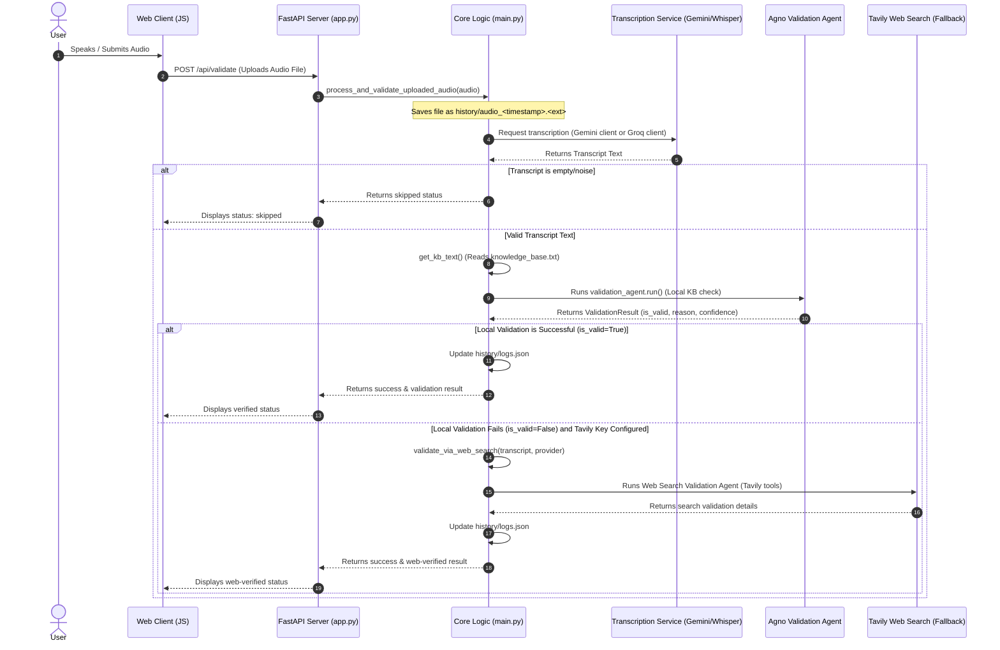
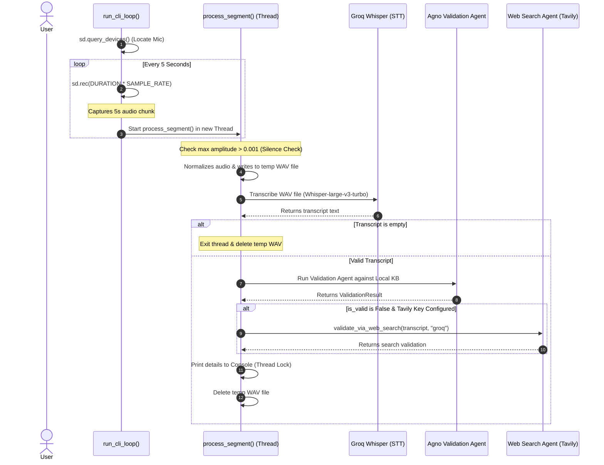

# Audio Validation Agent Workflow & Function Calls

This document provides a comprehensive overview of how the **Real-Time Audio Validation Agent** works. It details the step-by-step function execution sequence that occurs when the agent receives/records audio, transcribes it, validates it against a local knowledge base, and falls back to a web search validation if needed.

---

## 1. System Overview & Architecture

The application operates in two distinct modes:
1. **Web mode (Default)**: A FastAPI backend (`app.py`) serves the web interface, exposing endpoints for settings updates and segment validation.
2. **CLI mode (`--cli` flag)**: A terminal-based continuous listening loop (`main.py`) that captures audio chunks from the microphone, processes them in background threads, and outputs results directly to the console.

### Key Technologies Used:
* **FastAPI**: Backend web framework.
* **Agno AI**: Multi-agent framework orchestrating the Knowledge Validation and Web Search agents.
* **Gemini & Groq (Whisper / Llama 3.3)**: Large Language Models (LLMs) used for speech-to-text transcription and logical evaluation.
* **Tavily Search API**: Fallback web search capability to verify claims not found in the local knowledge base.
* **SoundDevice & SoundFile**: Core libraries for capturing microphone audio and creating WAV files in CLI mode.

---

## 2. Core Workflow Diagrams

### Web Mode Validation Flow


### CLI Mode (Microphone Listening) Flow


---

## 3. Function-by-Function Execution Breakdown

When the agent "listens to sound", specific functions are invoked. Below is the precise trace of these calls.

### A. Web API Mode (`app.py` & `main.py`)

#### 1. `app.py: validate_audio(audio: UploadFile)`
* **Trigger**: A client posts an audio clip to `/api/validate`.
* **Action**: Calls `await main.process_and_validate_uploaded_audio(audio)`. It acts as the HTTP interface layer.

#### 2. `main.py: process_and_validate_uploaded_audio(audio)`
* **Trigger**: Invoked by the FastAPI validator route.
* **Action**:
  1. Creates the `history` folder if it doesn't exist.
  2. Generates a unique timestamped filename `audio_<timestamp>.<ext>`.
  3. Writes the uploaded audio stream to disk using `shutil.copyfileobj`.
  4. Detects the active provider (`gemini` or `groq`) to determine transcription client.
  5. **Transcription Stage**:
     * **Gemini**: Calls `genai.Client(api_key).models.generate_content` using model `gemini-2.5-flash` passing the file content via `types.Part.from_bytes()`.
     * **Groq**: Calls `groq_client.audio.transcriptions.create` using model `whisper-large-v3-turbo`.
  6. **Filtering Stage**:
     * Filters the transcript using `should_validate_transcript()`. If the transcript is empty, represents background noise, or has 3 or fewer words, it deletes the file and returns a skipped status.
  7. **Validation Stage**:
     * Calls `get_kb_text()` to load the knowledge base string.
     * Instantiates an Agno `Agent` containing validation instructions and outputs a structured Pydantic object `ValidationResult` (schema containing: `is_valid: bool`, `reason: str`, and `confidence_score: int`).
     * Runs the validation agent.
  8. **Fallback Stage**:
     * If validation fails (`is_valid == False`) and a Tavily search key is present, it invokes `validate_via_web_search()`.
  9. **Logging & Cleanup**:
     * Saves/prepends the result to `history/logs.json`.
     * If logs exceed 50, prunes the oldest log and removes the corresponding audio file from disk.
     * Returns a dictionary representation of the result to the FastAPI endpoint.

---

### B. CLI Loop Mode (`main.py` only)

#### 1. `main.py: run_cli_loop()`
* **Trigger**: Executed when calling `python main.py --cli`.
* **Action**:
  1. Verifies `GROQ_API_KEY` is present.
  2. Queries default audio recording device specs using the `sounddevice` library (`sd.query_devices()`).
  3. Enters an infinite `while True` loop where each cycle:
     * Records a 5-second interval: `sd.rec(int(DURATION * SAMPLE_RATE), ...)`
     * Waits for recording to finish: `sd.wait()`.
     * Spawns a background worker thread executing `process_segment()` with a copy of the audio data.

#### 2. `main.py: process_segment(audio_data, sample_rate, segment_id)`
* **Trigger**: Spawned as a background thread from `run_cli_loop()`.
* **Action**:
  1. **Silence Filter**: Computes the maximum amplitude. If `max_val <= 0.001`, discards the chunk immediately.
  2. **Normalization**: Rescales the signal: `audio_data / max_val * 0.9`.
  3. **Temporary Storage**: Saves the normalized audio as a temporary `.wav` file using `soundfile.write`.
  4. **Transcription**: Sends the file to Groq's Whisper API (`groq_client.audio.transcriptions.create`) to get the transcript text.
  5. **Filtering**: Runs `should_validate_transcript()`. If the transcript is noise, empty, or has 3 or fewer words, exits the thread.
  6. **Validation**: Calls the local validation agent (`validation_agent.run()`).
  6. **Fallback**: If local validation fails and Tavily is enabled, calls `validate_via_web_search()`.
  7. **Display**: Prints the result block containing `Transcript`, `Valid`, `Confidence`, and `Reason` to the console using a `print_lock` to avoid garbling multi-threaded stdout.
  8. **Cleanup**: Deletes the temporary `.wav` file.

---

### C. Helper & Fallback Functions

#### 1. `main.py: validate_via_web_search(transcript, provider)`
* **Trigger**: Invoked as a fallback when local knowledge base validation fails, provided a `TAVILY_API_KEY` is present in the environment.
* **Action**:
  1. Prepares the LLM model (either `gemini-2.5-flash` or `llama-3.3-70b-versatile` depending on `provider`).
  2. Instantiates a separate Agno `Agent` named `"Web Search Validation Agent"`, configured with `TavilyTools` and instructions to format output using specific tags (`VALID:`, `CONFIDENCE:`, `REASON:`).
  3. Executes the agent with: `Validate the following statement using web search: '{transcript}'`.
  4. Parses the text response line-by-line to extract validation state, confidence, and reason.
  5. Returns a structured `ValidationResult`.

#### 2. `main.py: get_kb_text()`
* **Trigger**: Invoked in both CLI and Web modes before local validation.
* **Action**: Reads `knowledge_base.txt` and returns it as a string.

#### 3. `main.py: should_validate_transcript(transcript)`
* **Trigger**: Invoked during both Web validation and CLI segmentation after receiving transcription text.
* **Action**:
  1. Checks if the transcript is empty or standard punctuation.
  2. Filters out common speech-to-text noise tags (like `[music]`, `(laughter)`) using regular expressions and matches against known background noise phrase lists.
  3. Calculates the word count of the filtered transcript, returning `True` only if it exceeds 3 words (i.e. at least 4 words).

---

## 4. Key Data Structure: `ValidationResult`

The validation outputs are strictly enforced using Pydantic:

```python
class ValidationResult(BaseModel):
    is_valid: bool = Field(
        description="True if the transcript facts are correct according to the knowledge base, False otherwise."
    )
    reason: str = Field(
        description="A brief, one-sentence explanation of why the transcript was validated or why it failed based on the knowledge base."
    )
    confidence_score: int = Field(
        description="An integer between 0 and 100 representing the validation confidence level."
    )
```
